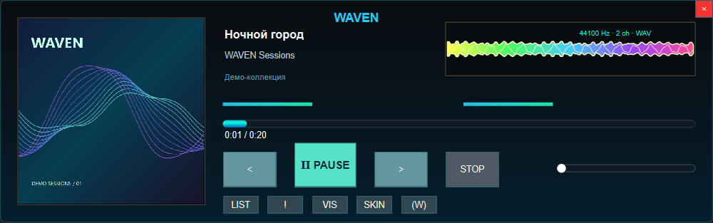
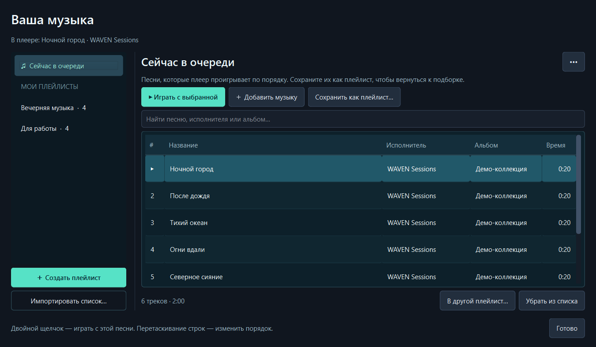
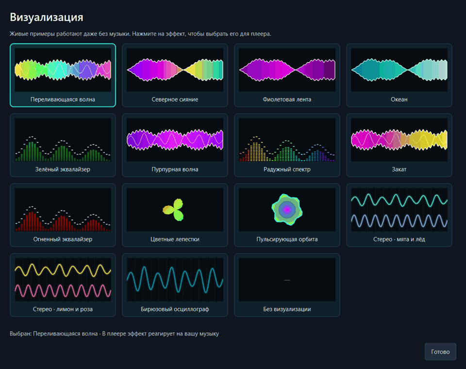
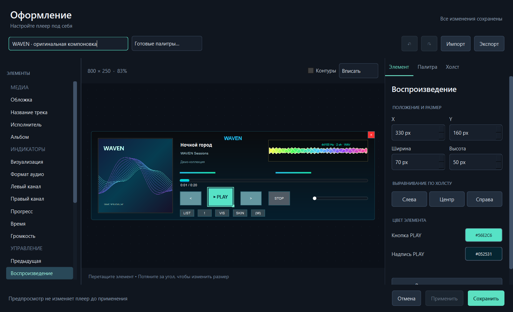

<div align="center">

# WAVEN Custom

**Знакомый компактный плеер. Сохраняемые плейлисты. Редактируемое оформление.**




</div>

Музыкальный плеер для Windows: компактное окно, сохраняемые плейлисты, живые визуализации и редактор оформления. Открывайте трек — остальные песни из его папки попадут в очередь автоматически. Доступны установщик и портативная версия.

Самостоятельная реализация по визуальному образцу WAVEN, а не восстановленный исходный код Garage Dev Studio.

[Установщик и портативная версия](https://github.com/lReDragol/waven-custom/releases/latest) · [Изменения](CHANGELOG.md)

## Что работает

| Возможность | Поведение |
| --- | --- |
| Открытие одного трека | Автоматически собирает очередь из музыкальных файлов той же папки и начинает с выбранного трека |
| Следующая / предыдущая | Сразу включает соседний трек очереди; порядок по именам с учётом чисел: 1, 2, 10 |
| Конец композиции | Автоматический переход к следующей; есть повтор одного трека или всей очереди |
| Плейлисты | Очередь отдельно от сохранённых подборок; добавление файлов и папок, перенос выбранных песен, изменение порядка мышью |
| Информация о песнях | Название, исполнитель, альбом и длительность из тегов; поиск по метаданным и имени файла |
| Сохранение | Плейлисты, очередь, позиция, громкость и тема сохраняются между запусками |
| Импорт / экспорт | M3U, M3U8 и PLS на вход; M3U8 на выход |
| Оформление | Элементы, холст, свойства, палитры, масштаб, выравнивание и отмена действий |
| Темы | Свой JSON-формат и импорт XML `WavenUIConfig` |
| Визуализация | 14 цветных эффектов с крупными анимированными примерами; в плеере — реакция на декодированное аудио |
| Кнопка PLAY | Контрастная надпись; отдельные цвета фона и текста с защитой читаемости |
| Повторный запуск | Файл передаётся уже открытому экземпляру плеера |

Поддерживаемые расширения: MP3, WAV, FLAC, M4A, AAC, OGG, OPUS, WMA, AIFF, MP4. Возможность декодирования конкретного файла зависит от кодеков Qt/FFmpeg. Обложка берётся из метаданных либо из `cover.jpg`, `folder.jpg`, `cover.png`, `folder.png` рядом с треком.

## Установка и запуск

Две сборки в [последнем выпуске](https://github.com/lReDragol/waven-custom/releases/latest). Python не требуется.

| Сборка | Как использовать |
| --- | --- |
| `WavenCustom-Setup-2.0.2-x64.exe` | Установщик на русском, установка для текущего пользователя, ярлыки и удаление через Windows |
| `WavenCustom-Portable-2.0.2-x64.zip` | Распаковать целиком в доступную для записи папку и запустить `Waven Custom.exe` |

Портативная версия хранит настройки и плейлисты в `Data` рядом с EXE. Файл `portable.flag` должен оставаться рядом с программой. Реестр при обычном запуске не изменяется.

При обновлении установщик сам закрывает плеер и мастер MP3 из выбранной папки и ждёт завершения процессов. Плеер сохраняет состояние обычным способом. Другие установки и портативные копии не закрываются. Если программа не отвечает или закрытие не завершилось, обновление останавливается до замены файлов — без принудительного завершения процесса.

### MP3 по умолчанию

Установщик регистрирует WAVEN Custom как обработчик аудио. На последнем шаге оставьте пункт **Настроить открытие MP3 в WAVEN Custom**. Мастер покажет текущий обработчик и кнопку открытия параметров Windows.

На Windows 10: **Музыкальный проигрыватель → текущий плеер → WAVEN Custom** с бирюзовой иконкой. На Windows 11 открывается страница приложения: выберите `.mp3` и подтвердите WAVEN Custom. Мастер автоматически проверяет фактическую команду открытия MP3 и показывает «Готово» только после успешного назначения именно этой копии плеера.

В старой версии 2.0.0 Windows могла показывать длинное имя **WAVEN Custom — музыкальный плеер**. Это то же приложение. Пункт **WAVEN.exe** с фиолетовой иконкой — другой, исходный плеер.

Windows не разрешает приложению незаметно назначить себя по умолчанию: требуется действие пользователя в системном интерфейсе. Программа использует [официальный механизм Windows](https://learn.microsoft.com/windows/apps/develop/windows-integration/default-apps-platform), без подмены защищённого `UserChoice`.

Позже этот же выбор доступен в меню **(W) → Сделать плеером по умолчанию…**. В портативном режиме регистрация выполняется только после подтверждения; после неё не переносите EXE без повторной регистрации.

Сборки не подписаны коммерческим сертификатом. Windows может показать предупреждение о неизвестном издателе; защита Windows установщиком не отключается.

Музыку можно перетащить на окно, открыть двойным щелчком по обложке или через меню **(W)**. Для открытия из Проводника: **Открыть с помощью → Выбрать другое приложение → Waven Custom.exe**. Выбор приложения по умолчанию выполняется средствами Windows.

### Сохранить любимые песни

1. Нажмите **LIST**.
2. Нажмите **Создать плейлист**, задайте имя и выберите **Добавить музыку**. Текущую очередь можно сохранить кнопкой **Сохранить как плейлист…**.
3. Выберите подборку слева и нажмите **Воспроизвести список**. Двойной щелчок по песне запускает список с неё.

Переименование, экспорт и удаление подборки — в меню **•••**. Для переноса песен выделите их и нажмите **В другой плейлист…**. Изменения сохраняются автоматически. Удаление из списка не удаляет музыкальный файл.

Теги читаются в фоне. Если названия в файле нет, показывается имя файла; приложение не придумывает недостающие данные и не меняет теги.



### Выбрать визуализацию

Нажмите **VIS** и выберите карточку. Крупные примеры анимируются даже на паузе и без выбранной музыки. Эффект применяется сразу и сохраняется между запусками. При уменьшении окна карточки перестраиваются в меньшее число колонок, а не сжимаются в полоски.

- Волны и ленты: переливающаяся волна, северное сияние, фиолетовая, океан, пурпурная и закат.
- Спектры: зелёные столбцы, радужные сегменты и огненный эквалайзер.
- Радиальные эффекты: цветные лепестки и пульсирующая орбита.
- Осциллографы: бирюзовый, стерео «мята и лёд», стерео «лимон и роза».

В главном окне амплитуда, частоты и каналы берутся из текущего аудио. У лент и радиальных эффектов есть дополнительное движение формы; переливающаяся волна плавно меняет цвет. На паузе эффект плеера останавливается, уровни плавно затухают. Карточки выбора используют отдельный демонстрационный сигнал и не зависят от громкости. Их анимация отключается при закрытии окна. Визуализацию плеера можно выключить.



### Изменить оформление

Нажмите **SKIN**. Слева — список элементов, в центре — холст, справа — свойства выбранного элемента.

- Перемещение мышью, изменение размера за угол и точные координаты в пикселях.
- Выравнивание по левому краю, центру или правому краю холста.
- Масштаб 50–150% и автоматическое вписывание; контуры можно скрыть.
- Палитры «Оригинал», «Графит» и «Светлая», отдельная настройка цветов.
- Отмена и повтор: **Ctrl+Z**, **Ctrl+Y**. Применение: **Ctrl+S**.

Вкладки **Элемент**, **Палитра** и **Холст** разделяют свойства объекта, общие цвета и размер окна. Цвета визуализации в теме задают начальные оттенки переливающейся волны; остальные эффекты используют собственные палитры. Старый выбор «Золотая волна» сохраняется как переливающаяся волна.

Цвета фона и надписи PLAY настраиваются отдельно. Если их контраст недостаточен, плеер автоматически выбирает читаемый цвет надписи.

**Применить** сохраняет результат без закрытия редактора. **Сохранить** завершает редактирование. **Отмена** отбрасывает изменения после последнего применения. Сброс отдельного элемента и всей темы доступен в инспекторе свойств; его тоже можно отменить.



## Клавиши

| Клавиши | Действие |
| --- | --- |
| Пробел | Воспроизведение / пауза |
| Ctrl+← / Ctrl+→ | Предыдущая / следующая |
| Ctrl+O | Открыть файлы |
| Ctrl+Shift+O | Открыть папку |
| Ctrl+L | Плейлисты |
| Ctrl+T | Редактор оформления |
| Колесо мыши | Громкость |
| Правая кнопка мыши | Меню |

Окно перемещается за свободную область. Размер 100–200%, повтор, перемешивание, сворачивание и режим поверх окон доступны в **(W)**. Выбранный размер сохраняется после перезапуска и смены темы. При переносе между мониторами Qt учитывает масштаб Windows каждого экрана: размер задаётся в логических пикселях без повторного деления на DPI.

## Исходники и сборка

```powershell
python -m pip install -r requirements.txt
python app.py
```

Передать начальный трек:

```powershell
python app.py "D:\Музыка\Track 02.mp3"
```

Собрать EXE:

```powershell
.\build.ps1
```

Собрать установщик и портативный ZIP (нужен [Inno Setup 6/7](https://jrsoftware.org/isinfo.php)):

```powershell
.\build-release.ps1
# Если компилятор установлен в другом месте:
.\build-release.ps1 -ISCC "C:\Tools\Inno Setup 6\ISCC.exe"
```

Результаты: `dist\Waven Custom.exe` и два дистрибутива в `releases\`.

| Файл | Назначение |
| --- | --- |
| `app.py` | Главное окно, воспроизведение, аудиоданные, один экземпляр |
| `playlists.py` | Окно очереди и сохранённых плейлистов |
| `track_metadata.py` | Фоновое чтение тегов через Mutagen |
| `visualizers.py` | Цветные эффекты и окно их выбора |
| `theme_editor.py` | Редактор оформления, история действий, инспектор и холст |
| `ui_style.py` | Общий стиль диалогов |
| `app_paths.py` | Разделение установленного и портативного профиля |
| `windows_integration.py` | Регистрация обработчика аудио и открытие настроек Windows |
| `windows_update.py` | Корректное закрытие обновляемой копии перед заменой EXE |
| `installer/waven.iss` | Установщик Inno Setup |
| `core.py` | Очередь, импорт/экспорт и сохранение библиотеки |
| `theme.py` | Координаты, цвета и импорт темы WAVEN |

## Данные

Установленная версия: `%APPDATA%\WavenCustom\library.json`. Портативная: `Data\library.json` рядом с EXE. Сохранение атомарное; повреждённый JSON сохраняется отдельной копией. Ошибки записываются в `player.log` рядом с библиотекой. Для переноса плейлистов сохраните папку данных; пути к музыкальным файлам должны остаться доступными. Удаление установленной программы не удаляет музыку и пользовательскую библиотеку.

Исходная установка WAVEN и её профиль не изменяются. Для тестов можно задать отдельную папку переменной `WAVEN_CUSTOM_DATA`.

## Границы текущей версии

Воссоздан основной экран WAVEN и добавлены перечисленные функции. Эффекты написаны заново по визуальным примерам; это не перенесённые плагины оригинала. DSP/VST-плагины, ProjectM, интернет-радио, тексты песен и графические скины формата `WavenSkin` не перенесены. Кнопка **!** открывает сведения о текущем файле, **VIS** открывает выбор эффекта, **(W)** открывает меню.

WAVEN — название оригинального приложения Garage Dev Studio. Этот проект — отдельная пользовательская реализация, не официальный выпуск WAVEN.
